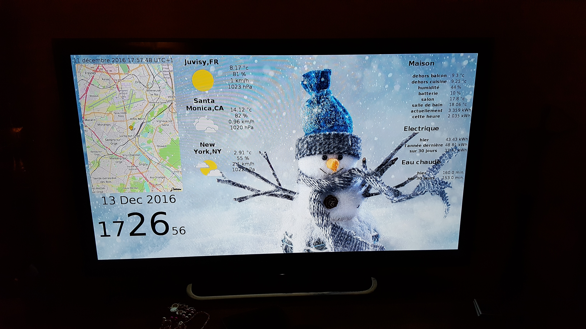

# Domotik




Domotik is a very simple home-automation software based on micro-services principle.
Each service (services folder) does only one thing. A script (mosquitto_pub) pushes the data on MQTT.
A another process (mosquitto_sub) is in charge of dispatch the data somewhere.
An another service (services folder) could calculate the mean or the max value, etc and push it on MQTT, etc, etc.

## Build it

```
back> docker build -t domotik-back .
front> docker build -t domotik-front .
bridge-to-mongodb> docker build -t domotik-bridge-to-mongodb .
bridge-to-elasticsearch> docker build -t domotik-bridge-to-elasticsearch .
```

## Run it

```
$> docker run -d --name elasticsearch -e "ES_JAVA_OPTS=-Xms512m -Xmx512m" docker.elastic.co/elasticsearch/elasticsearch:6.0.1
$> docker run -d --name kibana p 5601:5601 docker.elastic.co/kibana/kibana:6.0.1
$> docker run -d --name mongodb mongo:2
$> docker run -d --name mosquitto -p 1883:1883 -p 9883:9883 jllopis/mosquitto:v1.4.14 mosquitto

$> docker run -d --name domotik-back --link mosquitto:mosquitto domotik-back
$> docker run -d --name domotik-front --link mongodb:mongodb -p 3000:3000 domotik-front

$> docker run -d --name domotik-bridge-to-mongodb --link mosquitto:mosquitto --link mongodb:mongodb domotik-bridge-to-mongodb
$> docker run -d --name domotik-bridge-to-elasticsearch --link mosquitto:mosquitto --link elasticsearch:elasticsearch domotik-bridge-to-elasticsearch
```

## Use it

| service | link |
|---------|------|
| kibana dasboard | http://ip:5601 |
| tv dashboard | http://ip:3000/internal |
| history dashboard | http://ip:3000/history |
| MQTT broker | tcp://ip:1883 |


## TODO

- (re)create thin client for TV
- backup and cleanup (mongodb)
- migrate IoT sensors
- remove old raspberries
