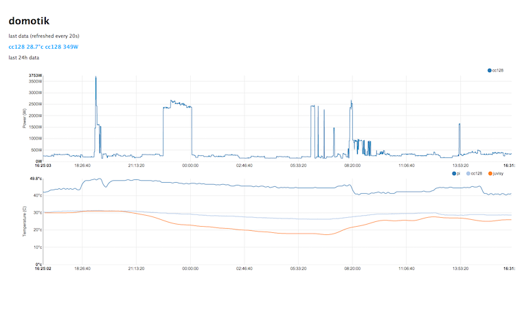

# domotik

Domotik is a very simple home-automation software based on micro-services principle.
Each service (services folder) does only one thing. A script (mosquitto_pub) pushes the data on MQTT.
A another process (mosquitto_pub) has the responsability to dispatch the data somewhere.
An another service (services folder) could calculate the mean or the max value, etc and push it on MQTT, etc, etc.

## installation
### raspberrypi
assume that you have installed a fresh raspbian…

### mosquitto
- sudo apt-get install mosquitto mosquitto-clients python-mosquitto

### node.js
- wget http://node-arm.herokuapp.com/node_latest_armhf.deb
- sudo dpkg -i node_latest_armhf.deb

### mongodb
- wget https://github.com/tjanson/mongodb-armhf-deb/releases/download/v2.1.1-1/mongodb_2.1.1_armhf.deb
- sudo dpkg -i mongodb_2.1.1_armhf.deb
- sudo /etc/init.d/mongodb start
- sudo update-rc.d mongodb defaults

### domotik
- cd /home/pi
- git clone https://github.com/sylvek/domotik.git
- cd /home/pi/domotik
- --> create and run your own sensors (crontab.txt)
- ./start.sh
- ...
- ./stop.sh

## sensors (mosquitto_pub)
several sensors push data over MQTT (read crontab.txt)
- pi temperature
- home int. temperature (via CurrentCost ENVI cc128, and via ws => https://github.com/lalelunet/measureit)
- power consumption (via CurrentCost ENVI cc128, and via ws => https://github.com/lalelunet/measureit)
- home ext. temperature and wind (via yahoo weather webservice)

## analyzers (mosquitto_sub)
several analyzers are available
- push data to syslog
- push data to csv
- push data to graphite
- push data to thinkspeak
- push data to mongodb
