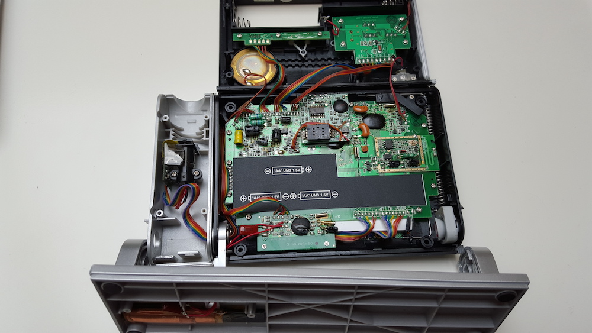
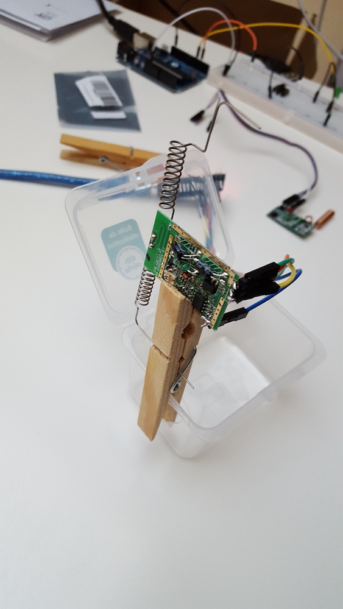
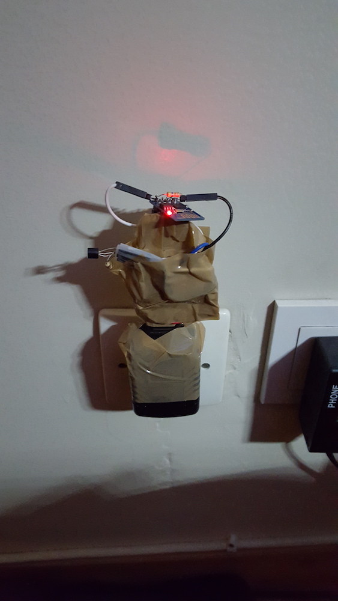
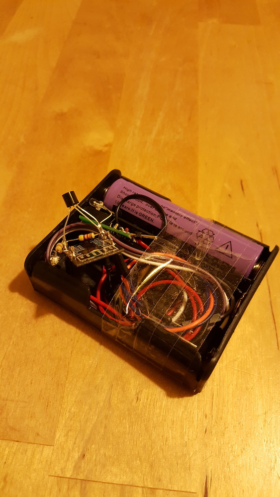
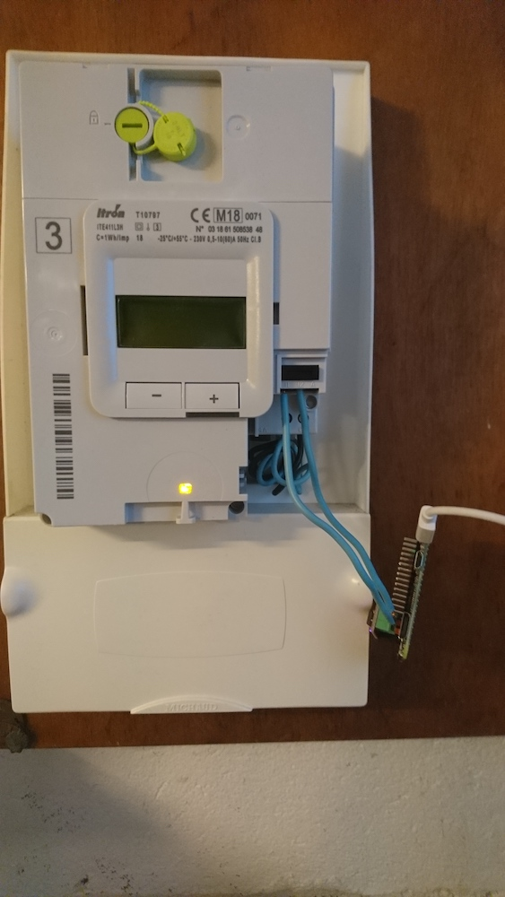
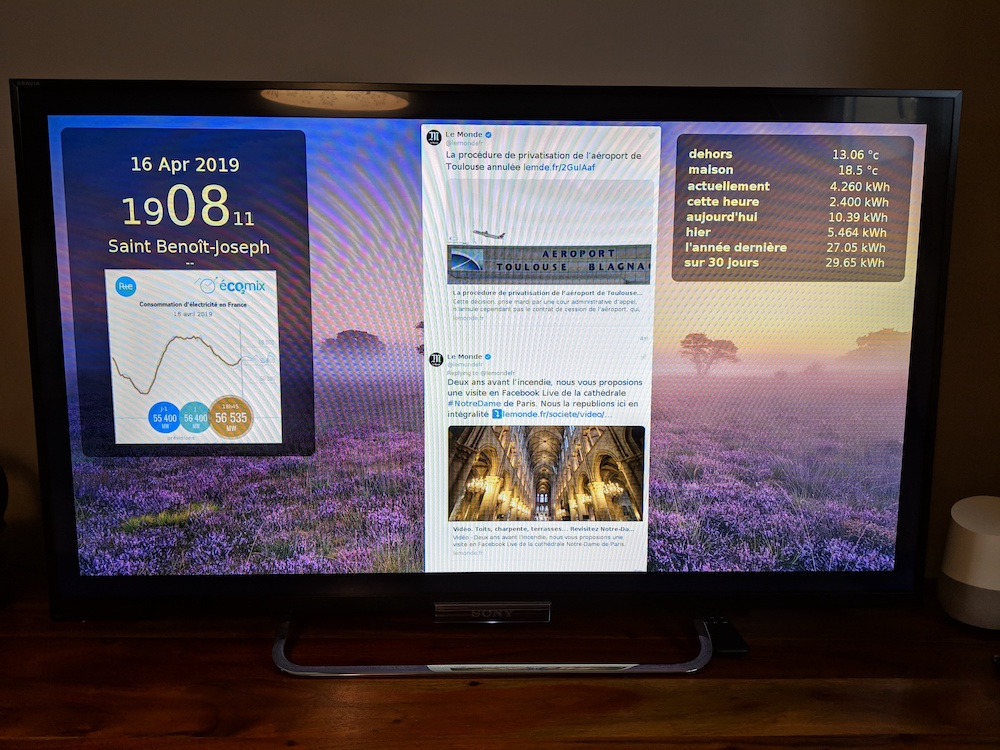
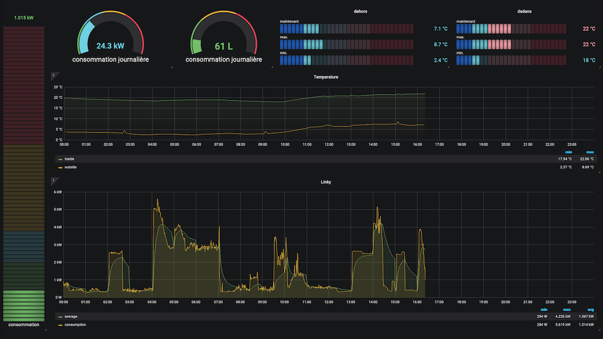
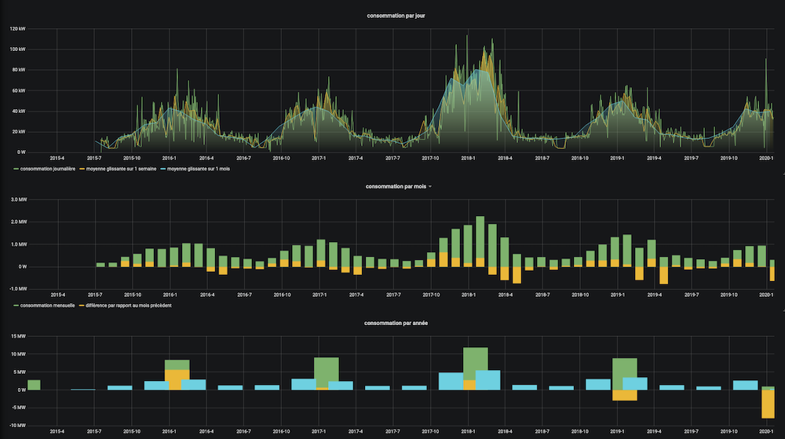

# Domotik


Domotik is a very simple home-automation software.

Originally, I've bought an [Envi CC128](http://www.currentcost.com/product-cc128.html), one Raspberry Pi 1 and I've used [measureit](https://github.com/lalelunet/measureit/wiki/The-end-of-the-measureit-project-%3F!) to display my power consumption. It was fun but charts were cheap and difficults to upgrade.

Early in 2015, i discovered [ESP8266](https://fr.wikipedia.org/wiki/ESP8266) chip, [Arduino UNO](https://en.wikipedia.org/wiki/Arduino_Uno) and IoT stuffs (like MQTT). I've decided to build my own devices…

I've took a comm' module from an Oregon Scientific Clock and plug it on a arduino board in order to receive data from an external temperature sensor [thgr-511](https://www.disteo-sante.fr/accessoires/1759-thgr-511-sonde-thermo-hygro-.html) (and that worked!)




Boosted by this success, I build several other temperature sensors.




In 2018 i received a [Linky](https://fr.wikipedia.org/wiki/Linky) and decided to [extract data with a Raspberry Pi Zero](https://github.com/sylvek/linkiki).



I've also built a webpage to display data to my TV.



This dashboard was firstly displayed thanks to an original Raspberry Pi 1 and recently on a Kindle Fire TV.

Server side, i've written several small scripts in Python using Mosquitto and Mongodb.
Basically, everything was running on a raspberry pi 0/1.

- In 2015, i start the project on raspberry pi,
- In 2017, i switched on an x86 computer and Docker,
- In 2020, i replaced my raspberry-pi "TV" by a [Kindle TV Stick + Fully Kiosk](https://www.fully-kiosk.com/en/#download-box),
- In 2022, i gave up influxdb and built a dedicated datastore _(based on golang and sqlite)_.
- In 2023, domotik works on a raspberry pi 0/1

## Build / Run it

### On AMD64/ARM64

```
> mkdir domotik
> wget https://raw.githubusercontent.com/sylvek/domotik/master/docker-compose.yml
> docker compose up

> #open http://localhost:3000 for the TV show
> #open http://localhost:3333 to display Grafana

> #You can simulate data by using [`mosquitto_pub`](https://mosquitto.org/man/mosquitto_pub-1.html).

> mosquitto_pub -h localhost -t sensors/outside/temp -m 4
> mosquitto_pub -h localhost -t sensors/linky/watt -m 4000
```

### On Raspberry Pi Zero/1 (armhf)

```
> mkdir /home/pi/domotik
> wget https://raw.githubusercontent.com/sylvek/domotik/master/docker-compose.armv6.yml
> docker compose -f docker-compose.armv6.yml up
```

## Use it

Basically i use 3 temperature sensors and a "watt meter".

| name              | topic                | unit     | usage                          |
| ----------------- | -------------------- | -------- | ------------------------------ |
| outside           | sensors/outside/temp | xx.xx °c | a value every 10 min           |
| living room       | sensors/living/temp  | xx.xx °c | a value every minute           |
| room              | sensors/room/temp    | xx.xx °c | a value every minute           |
| power consumption | sensors/linky/watt   | xxxxx    | a watt-hour value every second |

| service      | link                |
| ------------ | ------------------- |
| tv dashboard | http://your_ip:3000 |
| pc dashboard | http://your_ip:3333 |
| MQTT broker  | tcp://your_ip:1883  |

I use Grafana _(plugged on SQLite)_ to display more dashboards. _(look extras/grafana-save folder)_



